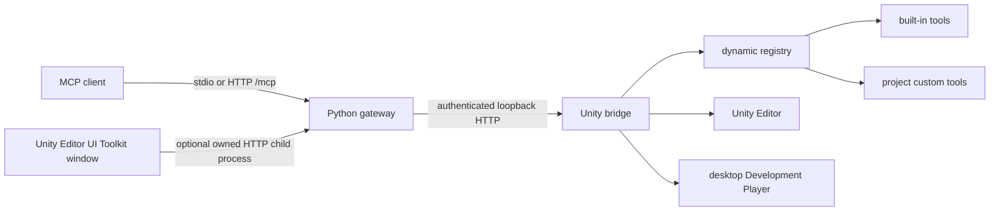

# Architecture

UnityMCP deliberately separates MCP transport from Unity execution. The Python
gateway owns MCP protocol concerns; the Unity package owns discovery, schemas,
permissions, and execution. There is no second, static Python tool registry.

## Process and instance model

One gateway connects to exactly one Editor or Player. Each Unity process writes a
descriptor containing `port`, a random bearer `token`, `pid`, `projectId`, unique
`instanceId`, `kind` (`editor` or `player`), and `buildId`. Descriptor files live
in an OS application-data directory, outside the project. Their file permissions
must be user-only where the operating system supports it.

Gateway ownership is explicit:

| Mode | Started by | MCP transport | Instance behavior |
|---|---|---|---|
| Client-managed (default) | MCP client | stdio | The Python gateway discovers one instance, or requires `--instance` when discovery is ambiguous. |
| Editor-managed (optional) | **Window > UnityMCP > Tools** UI Toolkit window | Streamable HTTP at `/mcp` | The Editor supplies its own descriptor's `instanceId`; the launcher never chooses a different open project. |

Instances of the same project share `projectId`, but never share a registry or
job namespace. If discovery finds multiple live instances and no `--instance`
was supplied, the gateway refuses to choose. Stale descriptors whose PID or
health check no longer matches are ignored.

The gateway is stdio-first. Streamable HTTP is optional, is exposed at `/mcp`,
and always binds `127.0.0.1`. The Unity bridge also binds loopback only. Node.js
is not part of the runtime or build toolchain.

### Editor-managed HTTP lifecycle and isolation

The UI Toolkit panel lets a user choose the gateway executable, a preferred port, and
the MCP path, then start, stop, copy client configuration, or regenerate the HTTP
bearer secret. All of that configuration is local per user/project rather than a Unity
asset. The panel renders process state (`Stopped`, `Starting`, `Running`, or `Error`)
without rendering the secret itself.

Starting a gateway creates one child Python process with `--transport
streamable-http`, the current Editor's explicit `--instance`, and `--parent-pid` set to
the Editor process. The HTTP server emits a readiness event only after its loopback
socket is bound; the Editor then marks it `Running`. The parent-PID watcher makes the
Python process exit when its originating Editor is gone. Before a domain reload Unity
stops the process it owns, then starts a fresh child once its bridge is ready again if
the gateway had been running. It stops the child permanently at Editor shutdown,
including recovery from a lost managed process reference after reload.

Port assignment is per running gateway. If a project's preferred port is already in
use, its launcher selects another free loopback port, so two Editors may both use the
same preference without sharing an endpoint. The actual endpoint and token must be
obtained through **Copy client config** after each gateway starts. A client that works
with multiple projects must configure one named HTTP MCP connection per copied endpoint;
one connection never multiplexes or auto-selects between Unity projects.

## Registry ownership and lifecycle

Unity is the single source of truth. Each descriptor includes JSON Schemas and
execution metadata for its tool. The Python gateway validates the registry,
builds an immutable snapshot, and exposes only entries that are:

1. implemented by the connected target;
2. valid after discovery and schema validation;
3. enabled by the user's local profile; and
4. in scope for that target (`editor` or `runtime`).

The documented [tool catalog](tool-catalog.json) is a product roadmap and CI
contract, not a fallback registry. A `planned` entry must never appear in MCP
`tools/list` until Unity actually reports an implementation.

Registry refresh uses `ETag` and `registryRevision`. A changed snapshot is swapped
atomically, then the gateway emits the MCP tool-list-changed notification. During
an Editor domain reload, the last valid snapshot may remain visible for at most
30 seconds with target state `target_reloading`; calls fail with a retryable error.
After that grace period, the gateway removes target tools except the cached
`unity-status` contract; calls report target unavailability until Unity
reconnects and a full registry fetch succeeds.

## Execution and concurrency

The bridge parses and authenticates requests off the Unity main thread, then
queues Unity API work to the main thread when `mainThread` is true. Each tool has
a bounded timeout. Synchronous methods, `Task<T>`, structured results, and job
handles share the same result envelope. Long-running operations return a `jobId`
and are observed or cancelled through job endpoints.

Mutation tools default to preview. A request changes state only when its schema
supports dry-run and `apply` is explicitly true. Editor scene mutations form a
Unity Undo group. Asset operations return a change journal; callers must not
assume transactional rollback for changes Unity cannot reverse safely.

## Distribution boundaries

- Python: `unity-mcp-server`, Python 3.11+, MCP Python SDK 2.x.
- Unity: UPM package `com.ducminh.unity-mcp`, Unity 6 (`6000.0+`).
- Runtime bridge: desktop Development Builds only, with a profile baked before
  build. Mono and IL2CPP are supported through a generated tool manifest and
  preservation metadata.
- Excluded from v1: production Player builds, mobile, WebGL, consoles, remote or
  cloud gateways, project Python plug-ins, and telemetry.
